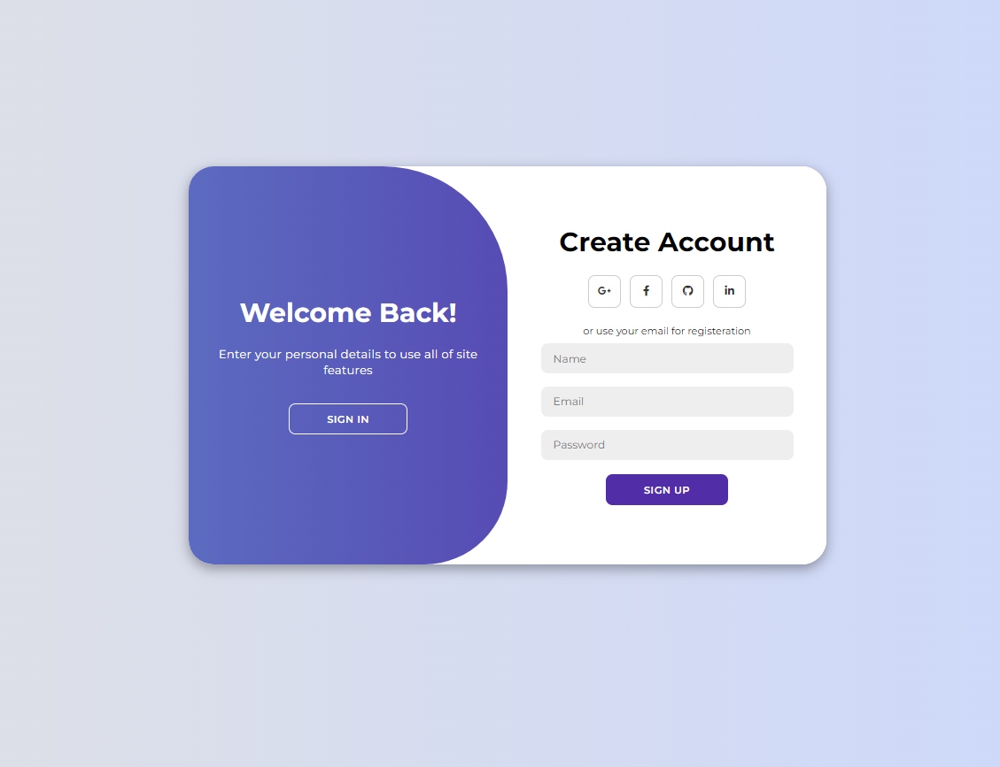

# Modern Login Page
I took references from ([YouTube](https://youtu.be/PlpM2LJWu-s)) for this project, which aims as an exercise in building a login page, where the project uses modern HTML, CSS and JavaScript to create a Login Page Design complete with Login and Register animations. uses CSS Flexbox, CSS transitions for some cool animation effects, and CSS keyframes too!

# Screenshot
Here we have project screenshot :

# notes
Here I also use my own imagination to understand the concept of the login page, because the video only shows the audience ASMR programming.(●'◡'●)